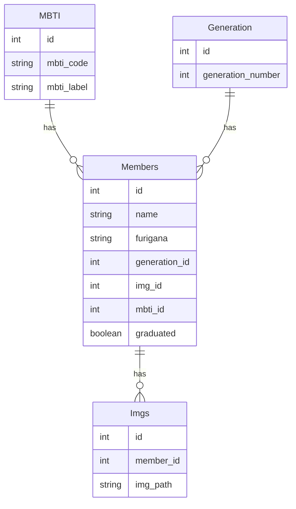

# sakuList ER図

```mermaid
erDiagram
    MBTI ||--o{ Members : has
    Generation ||--o{ Members : has
    Members ||--o{ Imgs : has

    Members {
        int id
        string name
        string furigana
        int generation_id
        int img_id
        int mbti_id
        boolean graduated
    }

    MBTI {
        int id
        string mbti_code
        string mbti_label
    }

    Generation {
        int id
        int generation_number 
    }

    Imgs {
      int id
      int member_id
      string img_path
    }

```
